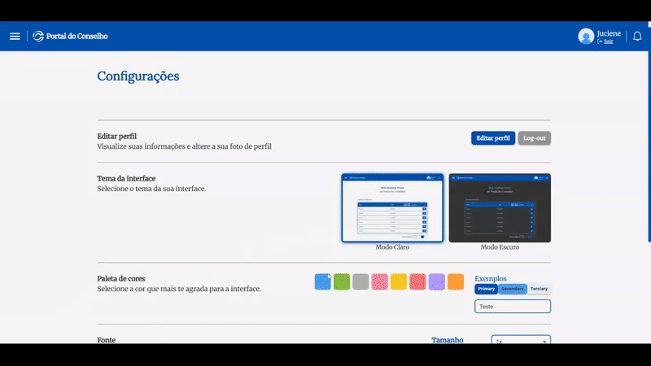

<h1 align="center">
  <br>
  <a href="http://www.amitmerchant.com/electron-markdownify"></a>
  <br>
	<br>
  Portal do Conselho
  <br>
</h1>

<h4 align="center">Sistema de devolução de feedbacks para a instituição <a href="https://www.sc.senai.br/" target="_blank">Senai</a>.</h4>

<p align="center">
  <a href="https://badge.fury.io/js/electron-markdownify"> 
	   </a>
	
  <a href="https://gitter.im/amitmerchant1990/electron-markdownify">
	  </a>
   
  <a href="https://saythanks.io/to/bullredeyes@gmail.com"> 
	   </a>
   
  <a href="https://www.paypal.me/AmitMerchant"> 
	   </a>
   
</p>

<p align="center">
  <a href="#descrição">Descrição</a> •
  <a href="#como-usar">Como usar</a> •
  <a href="#download">Download</a> •
  <a href="#créditos">Créditos</a> •
  <a href="#license">Licença</a>
</p>

<div align="center">
  
</div>

## Descrição

O **Portal do Conselho** é uma solução digital desenvolvida por cinco alunos da Aprendizagem Industrial do SENAI em parceria com a WEG (CentroWeg). O projeto nasceu para resolver um desafio crítico da instituição: **a gestão manual e presencial dos feedbacks dos conselhos de classe**, que gerava lentidão, sobrecarga e ineficiência na comunicação entre pedagogos, professores e centenas de alunos.  
> Tecnologia desenvolvida por alunos, para alunos: simplificando processos e fortalecendo a educação.

### 🎯 **Objetivo Principal**  
Automatizar e virtualizar o processo de envio e recebimento de feedbacks educacionais, substituindo reuniões presenciais individuais por uma plataforma centralizada, ágil e intuitiva.  

### ✨ **Funcionalidades-Chave**  

#### 👨🎓 **Para Estudantes**  
- Acessar seus feedbacks sobre desempenho e comportamento.  
- Participar do **Pré-Conselho**, enviando avaliações sobre professores, equipe pedagógica, estrutura.  

#### 👩🏫 **Para Pedagogos**  
- Criar conselhos de classe virtuais.  
- Atribuir feedbacks em massa para turmas inteiras.  
- Monitorar o progresso dos alunos de forma centralizada.  

#### 👨🏽🏫 **Para Professores**  
- Registrar anotações individuais sobre cada aluno.  
- Contribuir com observações específicas para os conselhos de classe.  

#### 👨💼 **Para Supervisores**  
- Acompanhar relatórios gerais e métricas das turmas.  
- Tomar decisões estratégicas com base em dados consolidados.  

### 🔄 **Fluxo de Feedback Bidirecional**  
- **Feedback Pedagógico**: Professores e pedagogos enviam avaliações detalhadas aos alunos de forma rápida e organizada.  
- **Pré-Conselho Estudantil**: Representantes de turma avaliam professores, pedagogos e a estrutura, promovendo transparência e melhoria contínua.  

### 🚀 **Impacto do Projeto**  
- **Redução de Burocracia**: Elimina a necessidade de chamadas presenciais individuais.  
- **Agilidade**: Feedbacks são entregues em tempo hábil, com clareza e organização.  
- **Transparência**: Alunos e professores participam ativamente de uma cultura de avaliação mútua.

## Tecnologias Utilizadas

<div align="left">
  
  
  
  
  
  
  
  
  
  
  
  
  
  
  
  
  
  
  
  
  
  
  
  
  
  
  
  
  
</div>

## Como Usar

nd run this application, you'll need [Git](https://git-scm.com) and [Node.js](https://nodejs.org/en/download/) (which comes with [npm](http://npmjs.com)) installed on your computer. From your command line:

```bash
# Clone this repository
$ git clone https://github.com/amitmerchant1990/electron-markdownify

# Go into the repository
$ cd electron-markdownify

# Install dependencies
$ npm install

# Run the app
$ npm start
```

> **Note**
> If you're using Linux Bash for Windows, [see this guide](https://www.howtogeek.com/261575/how-to-run-graphical-linux-desktop-applications-from-windows-10s-bash-shell/) or use `node` from the command prompt.

## Nossa Equipe

<div align="left"> <table> <tr> <td align="center" style="width: 33.33%;">
	<a href="https://github.com/username1">  <br /> <sub><b>John Doe</b></sub> </a> <br /> <sub>Frontend Developer</sub> </td> <td align="center" style="width: 33.33%;"> 
		<a href="https://github.com/username2">  <br /> <sub><b>Jane Smith</b></sub> </a> <br /> <sub>Backend Developer</sub> </td> <td align="center" style="width: 33.33%;"> 
			<a href="https://github.com/username3">  <br /> <sub><b>Alex Johnson</b></sub> </a> <br /> <sub>UI/UX Designer</sub> </td> </tr> <tr> <td align="center"> 
				<a href="https://github.com/username4">  <br /> <sub><b>Sam Wilson</b></sub> </a> <br /> <sub>DevOps Engineer</sub> </td> <td align="center"> 
					<a href="https://github.com/username5">  <br /> <sub><b>Taylor Brown</b></sub> </a> <br /> <sub>Project Manager</sub> </td> <td align="center"> 
						<a href="https://github.com/username6">  <br /> <sub><b>Morgan Lee</b></sub> </a> <br /> <sub>QA Engineer</sub> </td> </tr> </table> </div>

This software uses the following open source packages:

- [Electron](http://electron.atom.io/)
- [Node.js](https://nodejs.org/)
- [Marked - a markdown parser](https://github.com/chjj/marked)
- [showdown](http://showdownjs.github.io/showdown/)
- [CodeMirror](http://codemirror.net/)
- Emojis are taken from [here](https://github.com/arvida/emoji-cheat-sheet.com)
- [highlight.js](https://highlightjs.org/)

## Suporte

<a href="https://buymeacoffee.com/amitmerchant" target="_blank"></a>

## License

MIT

---

> [amitmerchant.com](https://www.amitmerchant.com) &nbsp;&middot;&nbsp;
> GitHub [@amitmerchant1990](https://github.com/amitmerchant1990) &nbsp;&middot;&nbsp;
> Twitter [@amit_merchant](https://twitter.com/amit_merchant)

