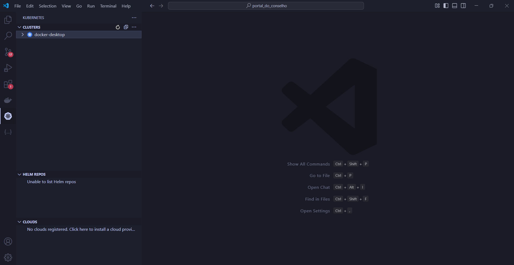
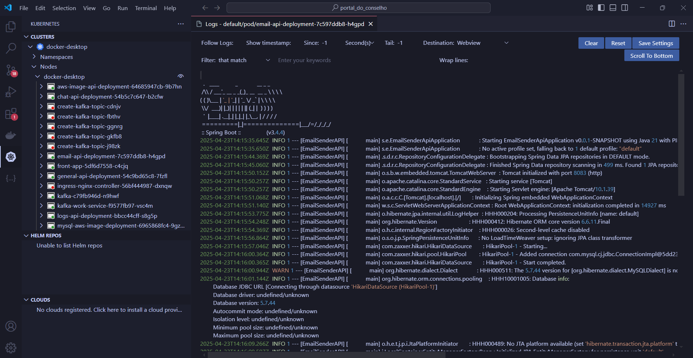

<h1 align="center">
  <br>
  <a href="http://www.amitmerchant.com/electron-markdownify"></a>
  <br>
	<br>
  Portal do Conselho
  <br>
</h1>

<h4 align="center">Sistema de devolução de feedbacks para a instituição <a href="https://www.sc.senai.br/" target="_blank">SENAI</a>.</h4>

<!-- <p align="center">
  <a href="https://badge.fury.io/js/electron-markdownify"> 
	   </a>
	
  <a href="https://gitter.im/amitmerchant1990/electron-markdownify">
	  </a>
   
  <a href="https://saythanks.io/to/bullredeyes@gmail.com"> 
	   </a>
   
  <a href="https://www.paypal.me/AmitMerchant"> 
	   </a>
   
</p> -->

<p align="center">
  <a href="#descrição">Descrição</a> •
  <a href="#tecnologias-utilizadas">Tecnologias Utilizadas</a> •
  <a href="#como-usar">Como usar</a> •
  <a href="#nossa-equipe">Nossa Equipe</a> •
  <a href="#suporte">Suporte</a> •
  <a href="#licença">Licença</a>
</p>

<div align="center">
  
</div>

## Descrição

O **Portal do Conselho** é uma solução digital desenvolvida por cinco alunos da Aprendizagem Industrial do SENAI em parceria com a WEG (CentroWeg). O projeto nasceu para resolver um desafio crítico da instituição: **a gestão manual e presencial dos feedbacks dos conselhos de classe**, que gerava lentidão, sobrecarga e ineficiência na comunicação entre pedagogos, professores e centenas de alunos.  
> Tecnologia desenvolvida por alunos, para alunos: simplificando processos e fortalecendo a educação.

### 🎯 **Objetivo Principal**  
Automatizar e virtualizar o processo de envio e recebimento de feedbacks educacionais, substituindo reuniões presenciais individuais por uma plataforma centralizada, ágil e intuitiva.  

### ✨ **Funcionalidades-Chave**  

#### 👨🎓 **Para Estudantes**  
- Acessar seus feedbacks sobre desempenho e comportamento.  
- Participar do **Pré-Conselho**, enviando avaliações sobre professores, equipe pedagógica, estrutura.  

#### 👩🏫 **Para Pedagogos**  
- Criar conselhos de classe virtuais.  
- Atribuir feedbacks em massa para turmas inteiras.  
- Monitorar o progresso dos alunos de forma centralizada.  

#### 👨🏽🏫 **Para Professores**  
- Registrar anotações individuais sobre cada aluno.  
- Contribuir com observações específicas para os conselhos de classe.  

#### 👨💼 **Para Supervisores**  
- Acompanhar relatórios gerais e métricas das turmas.  
- Tomar decisões estratégicas com base em dados consolidados.  

### 🔄 **Fluxo de Feedback Bidirecional**  
- **Feedback Pedagógico**: Professores e pedagogos enviam avaliações detalhadas aos alunos de forma rápida e organizada.  
- **Pré-Conselho Estudantil**: Representantes de turma avaliam professores, pedagogos e a estrutura, promovendo transparência e melhoria contínua.  

### 🚀 **Impacto do Projeto**  
- **Redução de Burocracia**: Elimina a necessidade de chamadas presenciais individuais.  
- **Agilidade**: Feedbacks são entregues em tempo hábil, com clareza e organização.  
- **Transparência**: Alunos e professores participam ativamente de uma cultura de avaliação mútua.

## Tecnologias Utilizadas

<div align="left">
  
  
  
  
  
  
  
  
  
  
  
  
  
  
  
  
  
  
  
  
  
  
  
  
  
  
  
  
  
</div>

## Como Usar

Nosso sistema utiliza atualmente o conceito de conteinerização, através do Docker, e seu respectivo gerenciamento com Kubernetes, tudo isso de forma a facilitar a implementação e utilização em diversos ambientes. Desse modo, para utilizar localmente o nosso sistema, basta que você tenha instalado em sua máquina um cluster Kubernetes, como o Minikube, Kind, Kubeadm, entre outros. Por questão de facilidade, recomendamos o <a href="https://www.docker.com/">Docker Desktop</a>, que tem o Kubernetes nativamente integrado (<a href="https://docs.docker.com/desktop/features/kubernetes/">Tutorial de como inicializá-lo</a>). 

Como ainda está em processo de containerização, o front-end está sendo rodado localmente, por isso será preciso também instalar o <a href="https://nodejs.org/pt">NodeJS</a> e modificar o arquivo de variáveis de ambiente, que está na pasta **front/app** na forma de **.env.example**, basta fazer uma cópia do arquivo e renomear para somente **.env** e configurá-lo dessa forma:

```bash
NEXT_PUBLIC_URL_GENERAL_API=http://localhost:8081
NEXT_PUBLIC_URL_CHAT_API=http://localhost:8082
NEXT_PUBLIC_URL_AWS_API=http://localhost:3060
NEXT_PUBLIC_URL_KAFKA_WORKSERVICE_API=http://localhost:3090
```

Após instalar o cluster Kubernetes e a ferramenta CLI kubectl, basta seguir os seguintes passos:

> **Nota:** Todos os comandos serão feitos no terminal git bash, se utilizar outro, pode ser que nem todos os comandos funcionem, como os scripts .sh.

```bash
# Clone o repositório
$ git clone https://github.com/Hivqs79/Portal_do_Conselho.git

# Entre dentro da pasta de front
$ cd Portal_do_Conselho/front/app

# Instale as dependências
$ npm install

# Entre dentro da pasta de scripts
$ cd ../../scripts

# Rode o script para criar os pods do kubernetes
$ ./create-pods.sh

# Rode o script para rodar a aplicação
$ ./run.sh
```

No melhor dos casos, após alguns segundos (30s a 60s) a aplicação já estara rodando e funcionando normalmente na url: http://localhost:3000/, no entanto pode acontecer alguns bugs e por isso recomendamos a instalação do <a href="https://code.visualstudio.com">Visual Studio Code</a> para melhor monitoramento da aplicação com a <a href="https://marketplace.visualstudio.com/items/?itemName=ms-kubernetes-tools.vscode-kubernetes-tools">extensão de Kubernetes da Microsoft</a>. Onde será possível ver os logs dos containers. Após instalar a extensão, basta clicar na aba Kubernetes e escolher o cluster que foi utilizado para inicializar a aplicação.



Nessa ferramenta, acesse o cluster que criou com o Docker Desktop e vá até a seção Nodes/{nome do cluster} para ver os pods ativos. Para visualizar um log de um container, basta passar o mouse por cima de um e clicar em Logs, (um icone com várias linhas) e apertar em Run no canto superior direito da tela que aparecer:



Agora vamos aos possíveis erros que podem ocorrer. O mais comum é que o Kafka tenha iniciado depois dos outros pods e não tenha funcionado a sua conexão, isso pode ser resolvido com o seguinte comando, ainda na pasta scripts:

```bash
$ ./restart-backend-pods.sh
```

Esse comando irá resetar todos os containers do back-end, ao fazer isso, o Kafka (que provavelmente já estará iniciado e rodando) vai conseguir se conectar com os outros pods e funcionar normalmente.

Alguns pods continuarão vermelhos, como os kafka-topic-creator e o ingress-nginx-controller, mas isso não afetará a funcão do sistema. 

No entanto, provavelmente o pod aws-image-api-deployment estará vermelho também, isso acontece por que não foi definido as chaves secretas da aws, que não compartilhadas por motivos de segurança e financeiro, por isso, caso queira testar a função de imagens de perfil, precisará adicionar suas próprias chaves. Para isto, basta copiar o arquivo aws-secret.yaml.secret, que está na pasta k8s e renomeá-lo para aws-secret.yaml e adicionar suas chaves nas variáveis region, access_key e secret_key. Após isso, basta aplicar  as configurações e rodar o script para recriar os pods, tudo dentro da pasta scripts:

```bash
$ kubectl apply -f ../k8s/aws-secret.yaml
$ ./restart-backend-pods.sh
```

### Aplicação

Caso tudo tenha funcionado corretamente, você poderá acessar sua aplicação pela url https://localhost:3000/. Para continuar com a aplicação, você deverá se logar como admin, que tem as credencias de **admin** e **@portalconselho1234!**. A partir desse momento, você pode criar usuários para você acessar seus perfis e testar toda a aplicação, mas lembre-se que para acessar o perfil desse usuário, você deverá cadastrar um email válido e resgatar a senha dele em uma mensagem de email, talvez a mensagem esteja na área de spam.

## Nossa Equipe

<div align="left"> <table> <tr> 
	<td align="center" style="width: 20%;"> <a href="https://github.com/Hivqs79">  <br /> <sub><b>Pedro Augusto Wilhelm</b></sub> </a> <br /> </td> 
	<td align="center" style="width: 20%;"><a href="https://github.com/Pedro-Panstein">  <br /> <sub><b>Pedro Henrique Panstein</b></sub> </a> <br /> </td> 
	<td align="center" style="width: 20%;"> <a href="https://github.com/mateusbosquetti">  <br /> <sub><b>Mateus Henrique Bosquetti</b></sub> </a> <br /></td> </tr> <tr> 
	<td align="center" style="width: 20%;"> <a href="https://github.com/viniciusEStos">  <br /> <sub><b>Vinícius Eduardo dos Santos</b></sub> </a> <br /> </td> 
	<td align="center" style="width: 20%;"> <a href="https://github.com/kwzzn">  <br /> <sub><b>Kauan Eggert</b></sub> </a> <br /></td> </tr> </table> </div>

## Suporte

Se você tiver alguma dúvida, sugestão ou encontrar algum problema com o projeto, sinta-se à vontade para entrar em contato.

📧 E-mail para suporte: [portal.do.conselho.email@gmail.com](mailto:portal.do.conselho.email@gmail.com)

## Licença

MIT
